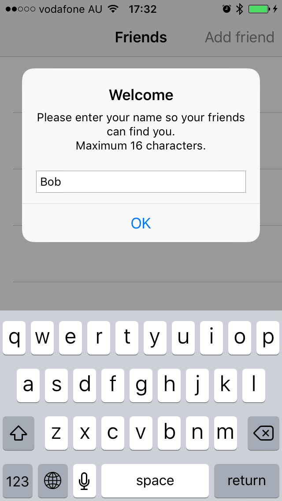
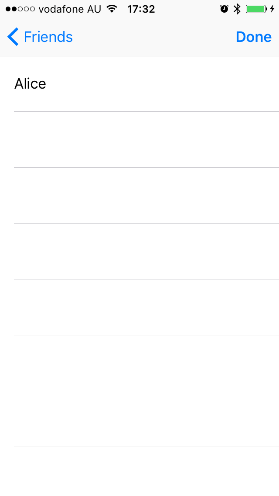
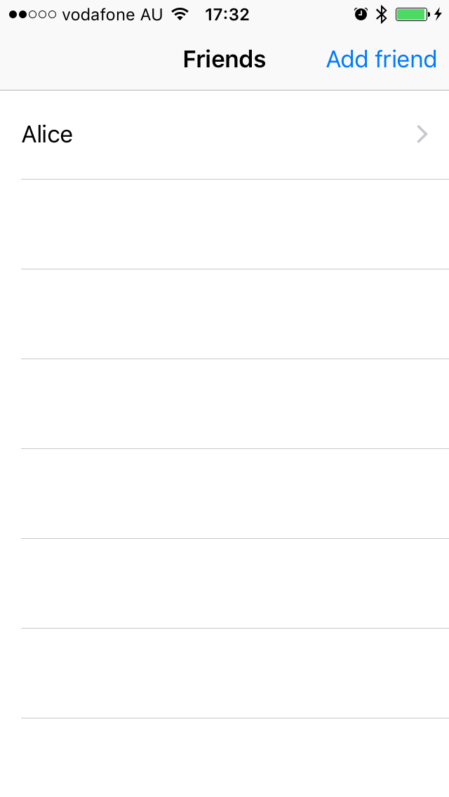
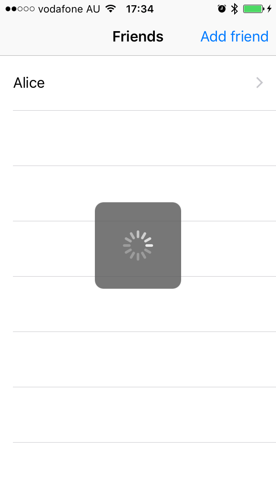
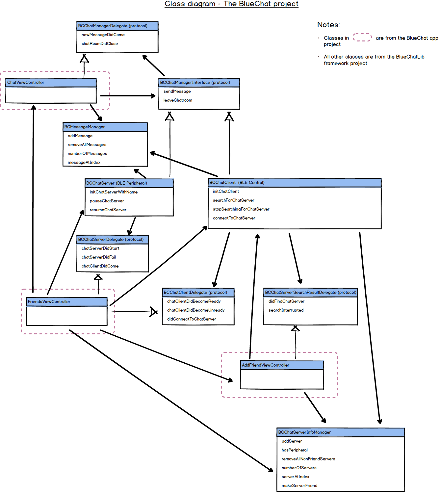

# BlueChat
1-to-1 Chat over Bluetooth LE

##### Requirements
* The application should advertise individually for each phone.
* You can select another phone and "add as friend" (no need to confirm with the other party).
* Once added, you should be able to start typing a message to be sent to the other phone.
* The other phone can respond to the message at any time.
* Only simple messages are required, for simplicity, feel free to keep the messages capped to a few (2-10) characters or so.
* As a bonus: give the ability to send up to 140 characters.

##### Demo

screen0 | screen1 | screen2 | screen3 | screen4 | screen5
------------ | ------------ | ------------ | ------------ | ------------ | ------------
 |  |  |  |  | 

Youtube [](http://www.youtube.com/watch?v=HsO0i3VDbXk)

##### Design considerations
* The users should not need to know how the two phones are connected over BLE and for them they just need to simply add another phone as a friend. It means the app needs to be able to hide the details of BLE central and peripheral and use the correct role in different scenarios
* The app runs in both Peripheral and Central roles and starts advertising as soon as it gets the name from the user inputs
* Though the search/connect parts are different on peripheral and central side, the chat procedures are common on both sides like sendMessage, leaveChatroom, newMessage notification etc and they are abstracted in [BCChatManager and BCChatManagerDelegate](BlueChatLib/BlueChatLib/BCChatManagerInterface.h)

##### Workflow on phone 1 (Central side [BCChatClient.h](BlueChatLib/BlueChatLib/BCChatClient.h) )
* (screen 0) When the app starts it asks for the name first
* (screen 1 - Peripheral) After getting the name it starts advertising with the name as Local Name and BCChatService as primary service
* (screen 2 - Central) When the user chooses to add a new friend it searches for nearby phones with BCChatService
* (screen 3 - Peripheral) After the user chooses a friend and goes back to Friends view it reloads the list and continues to advertise on the peripheral side
* (screen 4 - Central) When the user taps on a friend in the list, it stops advertising (Peripheral side) and connects to the app on phone 2 (Central side)
* (screen 5 - Central) After connected to the peripheral it goes to the chat view. It writes to BCChatCentralToPeripheralCharacteristic for sending messages and listens to Indication of BCChatPeripheralToCentralCharacteristic for receiving messages.

##### Workflow on phone 2 (Peripheral side [BCChatServer.h](BlueChatLib/BlueChatLib/BCChatServer.h) )
* (screen 0) When the app starts it asks for the name first
* (screen 1/3 - Peripheral) After getting the name it starts advertising with the name as Local Name and the BCChatService
* (screen 5 - Peripheral) After phone 1 connects to the app it enables notification on BCChatPeripheralToCentralCharacteristic, so phone 2 knows there is a client has come so it enters the chat view and also stops the advertisement. It updates BCChatPeripheralToCentralCharacteristic for sending messages and gets written value of BCChatCentralToPeripheralCharacteristic for receiving messages.
* (screen 5 - Peripheral) There is no way for CBPeripheralManager to close the connection so it writes to BCChatPeripheralToCentralDisconnectRequestCharacteristic to tell the other side to disconnect


##### BLE Service definition

```
/**
 *  UUID of the Chat Server service
 */
extern NSString *const BCChatServiceUUID;

/**
 *  UUID of the Characteristic for the central to send messages to the peripheral. Write only. The data is UTF8 encoded text.
 */
extern NSString *const BCChatCentralToPeripheralCharacteristicUUID;

/**
 *  UUID of the Characteristic for the peripheral to send messages to the central. Indicate and Read. The data is UTF8 encoded text.
 */
extern NSString *const BCChatPeripheralToCentralCharacteristicUUID;

/**
 *  UUID of the Characteristic for the peripheral to tell the central to disconnect. Indicate and Read. The data is a one-byte integer and the value is not checked by the central.
 */
extern NSString *const BCChatPeripheralToCentralDisconnectRequestCharacteristicUUID;
```
Check [BCConstants.m](BlueChatLib/BlueChatLib/BCConstants.m) for the UUIDs

##### Future improvements
* Nothing is persisted currently. In future, we can save the server name, friend list etc.
* There is no special treatment to support 140 characters in the message because it is directly supported by CoreBluetooth, but if the app needs to work with Android or other devices the other party might not be able to handle such a long packet and some kind of application level protocol needs to be developed.
* There is no simple way to track write results when there are multiple pending write operations. Currently, the app takes the CB write callback as the result of the first pending write operation but it might not be accurate all the time. Again application level protocol might be needed.
* The connection is limited to one to make the UI simple but it shouldn't be too hard to support multiple chats (still each chat is 1-to-1).

##### Class diagram


